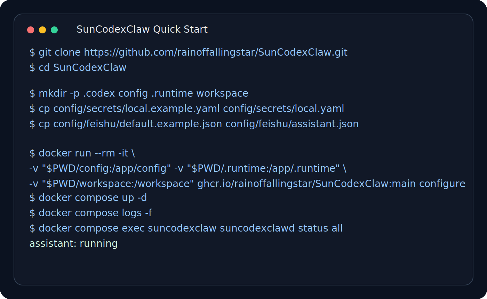
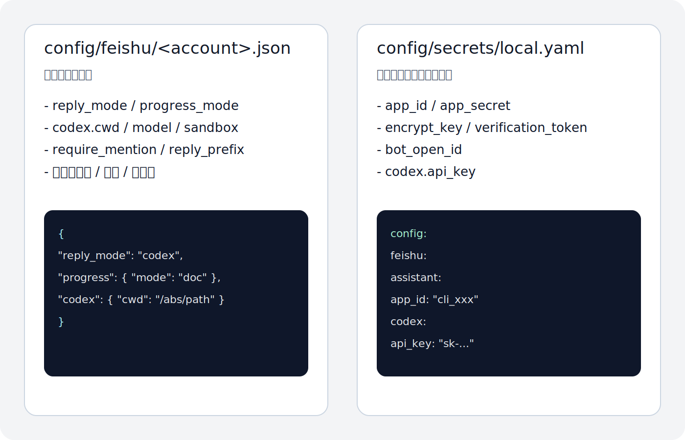
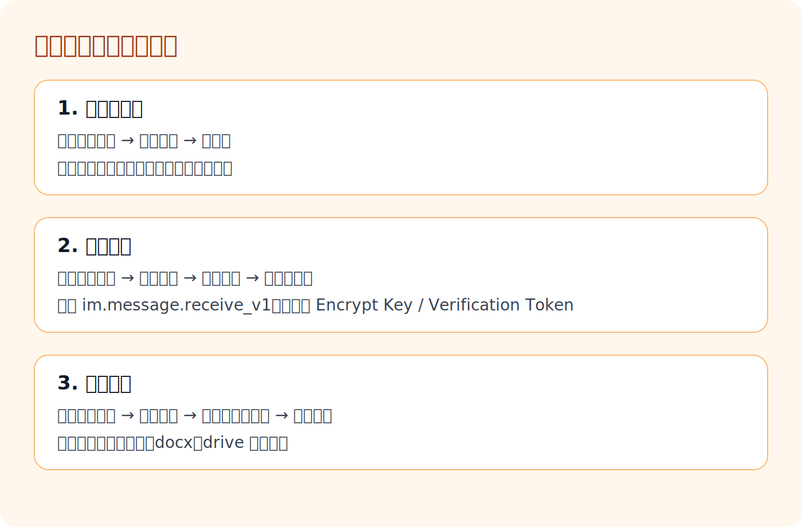

# SunCodexClaw

`SunCodexClaw` 是一个面向飞书工作流的 Codex 机器人项目。

它不是把 LLM 包一层聊天壳，而是把飞书消息、Codex 工作区、文件读写、云文档进度、多账号运行和本机执行能力串成一条能真正干活的链路。



## 一句话

我自己写了一个 Codex 版本的 OpenClaw：`SunCodexClaw`。

名字是这么宣传的，但这里只是功能和概念方向和 OpenClaw 比较接近，没有借鉴 OpenClaw 的代码。

它主要解决了这些问题：

1. 浪费 Token 的问题：这个项目说多少就费多少，不浪费。
2. 稳定性差的问题：没有额外网关，直接运行，不会动不动就崩。
3. 只能陪聊、不干活的问题：它直接连的是 `Codex CLI`，可以写代码、改项目、干真活。
4. 多 Agent 协作的问题：支持多个机器人一起干活，互相独立进程、独立路径、互不干扰。
5. 记忆和扩展的问题：它本身就有记忆，也支持 Skills，因为底层就是 Codex。
6. 飞书反馈体验的问题：收到消息会马上回复，不会装死；推送文档里会持续告诉你实时进展，比流式靠谱，也比腹泻式回复靠谱。
7. 飞书附件能力的问题：支持图片、文件的输入和输出，也可以把你发来的文件落到电脑上处理。
8. 电脑操作能力的问题：因为底层是 Codex，所以支持直接操作你的电脑；在 GPT 5.4 下，这类操作的准确度也明显更高。

我最近一段时间都是用它干活。

一顿饭下来，我的网页可以改好几版。

## 用起来如图


## 这是什么

项目核心是：

- 飞书 WebSocket 长连接收消息
- 按账号把消息路由到对应的 `codex cwd`
- 用 `codex exec --json` 执行任务
- 把过程写回飞书消息或飞书云文档
- 支持图片分析、图片回传、语音输入转写、文件读取、文件回传、线程记忆、Skills、本机操作

这套项目特别适合那种“在飞书里提任务，机器人直接去代码库和电脑上干活，再把过程回给你”的工作方式。

## 和 OpenClaw 的区别

相对 OpenClaw 这类更通用的聊天外壳，这个项目的设计重点是“在飞书里把事做完”：

- 更稳定：
  - 没有额外网关，机器人就是直接在本机运行
  - 链路更短、少一层中间环节，所以更不容易出现那种突然崩溃、整体掉线的问题
- 更省 token：
  - 只保留有限轮历史，而不是无上限堆聊天记录
  - 图片和文件先下载到本地，再把本地路径交给 Codex，避免把大块原文反复塞进上下文
  - 进度默认走飞书消息或云文档，不把完整过程反复塞回模型
- 更像真正干活的机器人：
  - 它直接跑本机 `codex exec`
  - 所以可以读写文件、执行命令、在工作目录里改代码、产出文件并回发给飞书
- 支持多 agent 同时运行：
  - 可以给不同 agent 配独立目录
  - 互不干扰，并行处理各自的任务和工作区
- 对飞书适配更深：
  - 支持群聊 `@` 触发
  - 支持“先 @ 再单独发文件/图片”的连续工作流
  - 支持飞书云文档进度、文档排版、文档链接回发
  - 支持多账号、多机器人统一启停和 LaunchAgents
- 自带记忆：
  - 每个会话有线程上下文
  - 支持 `/thread new`、`/thread switch`、`/reset`
- 同样支持 Skills：
  - 机器人背后跑的是 Codex
  - 只要你的 Codex 环境能用 Skills，这个机器人也能用
- 可以操作电脑：
  - 本质上是 Codex 在你的机器上执行
  - 在 `codex` 权限允许的前提下，可以直接处理本机文件、命令和项目工作区

如果你要的是“飞书里的助手真的能去代码库和电脑上干活”，这个项目比一个通用聊天壳更合适。

## 工作方式

你在飞书里给机器人发消息，机器人会按下面的路径工作：

1. 收到文本 / 图片 / 文件 / 语音消息
2. 归一化成适合 Codex 的输入
3. 在账号绑定的 `codex.cwd` 里执行 `codex exec`
4. 持续记录进度
5. 把最终回复、文件或云文档链接回发到飞书

这意味着它的核心不是“聊天”，而是“消息驱动的本机执行”。

## 先决条件

在使用这个项目之前，你需要先有：

- 可正常使用的 `codex` CLI
- 对应的 Codex / OpenAI token 或已登录态
- 一台能运行 `codex` 的机器
- 一个飞书企业自建应用

官方参考：

- [OpenAI Codex getting started](https://help.openai.com/en/articles/11096431-openai-codex-ci-getting-started)
- [Codex CLI and ChatGPT plan access](https://help.openai.com/en/articles/11381614-codex-cli-and-chatgpt-plan-access)
- [OpenAI API keys](https://platform.openai.com/api-keys)
- [飞书开放平台控制台](https://open.feishu.cn/app)
- [飞书开放平台文档首页](https://open.feishu.cn/document/home/index)

## 安装

建议直接在你平时用来跑 Codex 的环境里 clone 这个项目。

```bash
git clone git@github.com:Sunbelife/SunCodexClaw.git
cd SunCodexClaw
npm install
```

如果你是在 Codex 的工作环境里操作，直接把这个仓库 clone 到本机，再按下面步骤配置即可。

## Docker 镜像（GitHub Actions 自动构建）

本项目已提供 GitHub Actions：在推送到 `main` 或打 `v*` tag 时，自动构建并推送 Docker 镜像到 GHCR（`ghcr.io/rainoffallingstar/SunCodexClaw`）。

拉取镜像：

```bash
docker pull ghcr.io/rainoffallingstar/SunCodexClaw:main
```

镜像内已安装 `codex` CLI，并约定将 `CODEX_HOME` 设为 `/home/node/.codex`。你可以把宿主机的 `.codex` 目录挂载进去，先在容器里用命令行完成登录/配置，然后直接启动机器人服务。

如果你的 `codex` 需要走自定义网关/代理（自建 base url），可在 `config/*` 里配置 `codex.base_url`，或在运行容器时设置环境变量 `FEISHU_CODEX_BASE_URL`（会传递给 `codex` 进程的 `OPENAI_BASE_URL/OPENAI_API_BASE`）。

准备（建议在宿主机准备好可挂载目录）：

```bash
mkdir -p .codex config
cp config/secrets/local.example.yaml config/secrets/local.yaml
cp config/feishu/default.example.json config/feishu/assistant.json
```

如果你希望按“容器内固定工作目录”来配置 `codex.cwd`/`codex.add_dirs`（例如统一挂载到 `/workspace`），可以用交互式脚本生成账号配置：

```bash
npm run go:configure
```

如果你希望用 Go 来做“缺失项发现 + 交互式补齐”，可使用：

```bash
./bin/suncodexclawd configure
```

向导会按推荐拆分写入：

- `config/secrets/local.yaml`：飞书密钥、`codex.api_key`、（可选）`codex.base_url` 等敏感项
- `config/feishu/<account>.json`：`bot_name`、progress 文档标题、`codex.cwd/add_dirs/sandbox/approval_policy` 等运行项

说明：Go 向导会直接读写 `local.yaml`（保留旧布局兼容），不再依赖 Node 的 YAML 依赖。

交互式配置（在容器里执行 `codex` 命令，写入挂载的 `.codex`）：

```bash
docker run --rm \
  -it \
  -v "$PWD/.codex:/home/node/.codex" \
  -v "$PWD/config:/app/config" \
  ghcr.io/rainoffallingstar/SunCodexClaw:main shell
```

随后启动所有飞书机器人服务（会按 `config/feishu/*.json` 中除 `default.json` 外的账号启动；例如上面的 `assistant.json`）：

```bash
docker run --rm \
  -v "$PWD/.codex:/home/node/.codex" \
  -v "$PWD/config:/app/config" \
  -v "$PWD/.runtime:/app/.runtime" \
  -v "<HOST_WORKSPACE>:/workspace" \
  ghcr.io/rainoffallingstar/SunCodexClaw:main
```

本机使用该转发时，先构建 Go 二进制：

```bash
npm run go:build
```

只启动一次（不自动重启 crash loop；适合排障）：

```bash
docker run --rm \
  -v "$PWD/.codex:/home/node/.codex" \
  -v "$PWD/config:/app/config" \
  -v "$PWD/.runtime:/app/.runtime" \
  -v "<HOST_WORKSPACE>:/workspace" \
  ghcr.io/rainoffallingstar/SunCodexClaw:main start --once
```

严格启动检查（如果任一账号未在短时间内起来则退出非 0；适合 CI/部署自检）：

```bash
docker run --rm \
  -v "$PWD/.codex:/home/node/.codex" \
  -v "$PWD/config:/app/config" \
  -v "$PWD/.runtime:/app/.runtime" \
  -v "<HOST_WORKSPACE>:/workspace" \
  ghcr.io/rainoffallingstar/SunCodexClaw:main start all --strict-start --start-check-delay 2s
```

也可以用 `docker compose`（见 `docker-compose.yml`，把 `./workspace` 换成你自己的工作区路径或使用 bind mount）：

```bash
cp .env.example .env
# 如果使用 bind mount，确保宿主机目录对容器用户可写（否则 pid/log/自动持久化会失败）
# Linux 常用：SUNCODEXCLAW_UID=$(id -u), SUNCODEXCLAW_GID=$(id -g)
docker compose up -d
docker compose logs -f
```

可选：启用健康检查接口（容器内 `:8080`，路径 `/healthz`、`/readyz`、`/status`）：

```bash
docker run --rm \
  -p 8080:8080 \
  -e SUNCODEXCLAW_HEALTH_ADDR=:8080 \
  -v "$PWD/.codex:/home/node/.codex" \
  -v "$PWD/config:/app/config" \
  -v "$PWD/.runtime:/app/.runtime" \
  -v "<HOST_WORKSPACE>:/workspace" \
  ghcr.io/rainoffallingstar/SunCodexClaw:main
```

可选：调整重启策略（环境变量）：

- `SUNCODEXCLAW_NO_RESTART=true` 禁止崩溃自动重启
- `SUNCODEXCLAW_MAX_RESTARTS=20`、`SUNCODEXCLAW_RESTART_WINDOW=10m` 限制 crash loop

查看某个账号日志（容器内子命令）：

```bash
docker run --rm \
  -v "$PWD/.codex:/home/node/.codex" \
  -v "$PWD/config:/app/config" \
  -v "$PWD/.runtime:/app/.runtime" \
  -v "<HOST_WORKSPACE>:/workspace" \
  ghcr.io/rainoffallingstar/SunCodexClaw:main logs assistant -f
```

查看全部账号日志（tail，容器内子命令）：

```bash
docker run --rm \
  -v "$PWD/.codex:/home/node/.codex" \
  -v "$PWD/config:/app/config" \
  -v "$PWD/.runtime:/app/.runtime" \
  -v "<HOST_WORKSPACE>:/workspace" \
  ghcr.io/rainoffallingstar/SunCodexClaw:main logs all
```

说明：`logs --follow` 支持单账号或全部账号；多账号同时 follow 会输出带账号前缀的多路日志。
说明：`logs` 需要显式指定账号或 `all`。

如果某个账号反复崩溃触发重启限流，daemon 会在 `.runtime/feishu/errors/<account>.err` 记录 `last_error`，并在 `status` 输出里展示。

启动前预检（等价于对每个账号跑一次 `--dry-run`）：

```bash
docker run --rm \
  -v "$PWD/.codex:/home/node/.codex" \
  -v "$PWD/config:/app/config" \
  -v "$PWD/.runtime:/app/.runtime" \
  -v "<HOST_WORKSPACE>:/workspace" \
  ghcr.io/rainoffallingstar/SunCodexClaw:main preflight
```

发布版本：创建并 push 一个形如 `v1.2.3` 的 tag，Actions 会额外推送对应 tag 的镜像。

## 配置模型

当前读取顺序是：

1. 命令行参数
2. 环境变量
3. `config/secrets/local.yaml`
4. `config/feishu/<account>.json`

推荐把配置拆成两层：

- `config/secrets/local.yaml`
  - 放敏感项和本机私有配置
  - 例如：飞书应用密钥、Bot Open ID、Codex token、语音转写 key
- `config/feishu/<account>.json`
  - 放非敏感运行项
  - 例如：回复模式、工作目录、进度模式、群聊触发规则

如果要启用语音输入，建议配置一个 `speech` 段；不单独配置 `speech.api_key` 时，默认会复用 `codex.api_key` 做转写。



目录结构：

```text
SunCodexClaw/
├── config/
│   ├── feishu/
│   │   ├── default.example.json
│   │   └── <account>.json
│   └── secrets/
│       ├── local.example.yaml
│       └── local.yaml
├── docs/images/
├── tools/
│   ├── feishu_ws_bot.js
│   ├── feishu_bot_ctl.sh
│   ├── install_feishu_launchagents.sh (deprecated wrapper)
│   └── lib/local_secret_store.js
└── README.md
```

## Deprecated

- `tools/install_feishu_launchagents.sh`：兼容 wrapper（已 deprecated），请改用 `./bin/suncodexclawd launchagents ...`
- `tools/configure_docker_config.js`：旧的 Docker 配置向导（已 deprecated），请改用 `npm run go:configure`
- `tools/feishu_bot_ctl.sh`：兼容 ctl 脚本（建议直接用 `./bin/suncodexclawd ...`）
- `npm run docker:configure`：已 deprecated（等价于运行旧的 `tools/configure_docker_config.js`），建议用 `npm run go:configure`
- `npm run feishu:*`：已逐步 deprecated（仍可用但会提示），建议改用 `./bin/suncodexclawd <cmd>`

## 配置示例

先复制模板：

```bash
cp config/secrets/local.example.yaml config/secrets/local.yaml
cp config/feishu/default.example.json config/feishu/default.json
```

### `config/secrets/local.yaml`

这是推荐的主配置位置，尤其是敏感项：

```yaml
config:
  feishu:
    assistant:
      app_id: "cli_xxx"
      app_secret: "..."
      encrypt_key: "..."
      verification_token: "..."
      bot_open_id: "ou_xxx"
      bot_name: "飞书 Codex 助手"
      domain: "feishu"
      reply_mode: "codex"
      reply_prefix: "AI 助手："
      require_mention: true
      require_mention_group_only: true
      progress:
        enabled: true
        mode: "doc"
        doc:
          title_prefix: "AI 助手｜任务进度"
          share_to_chat: true
          link_scope: "same_tenant"
          include_user_message: true
          write_final_reply: true
      codex:
        bin: "codex"
        api_key: "sk-..."
        model: "gpt-5.4"
        reasoning_effort: "xhigh"
        cwd: "/absolute/path/to/workspace"
        add_dirs:
          - "/absolute/path/to/another/workspace"
        history_turns: 6
        sandbox: "danger-full-access"
        approval_policy: "never"
```

### `config/feishu/<account>.json`

这个文件适合放本机非敏感覆盖：

```json
{
  "bot_name": "AI 助手",
  "reply_mode": "codex",
  "reply_prefix": "AI 助手：",
  "require_mention": true,
  "require_mention_group_only": true,
  "progress": {
    "enabled": true,
    "mode": "doc",
    "doc": {
      "title_prefix": "AI 助手｜任务进度"
    }
  },
  "codex": {
    "cwd": "/absolute/path/to/workspace",
    "add_dirs": [
      "/absolute/path/to/another/workspace"
    ]
  }
}
```

### 配置建议

- 密钥尽量只放 `local.yaml`
- `config/feishu/<account>.json` 留给运行参数
- 部署时优先显式填写 `bot_name`，让群里 `@` 识别和 `bot_open_id` 自动探测更稳定
- 每个机器人单独配置 `codex.cwd`
- 如果需要跨多个目录工作，可以额外配置 `codex.add_dirs`
- `bot_open_id` 可以不手填，群里第一次成功 `@` 机器人后会自动探测并持久化
- 如果你已经通过 `codex login` 登录，也可以不填 `codex.api_key`

## 快速验证

先做预检（等价于对账号跑一次 bot 的 dry-run）：

```bash
./bin/suncodexclawd preflight assistant
```

如果输出里看到这些关键信号，基本就通了：

- `app_id_found=true`
- `app_secret_found=true`
- `codex_found=true`
- `progress_mode=doc` 或你自己的配置值
- `codex_cwd=...`

## 飞书开放平台设置

### 控制台入口

- 控制台首页：[open.feishu.cn/app](https://open.feishu.cn/app)
- 文档首页：[open.feishu.cn/document/home/index](https://open.feishu.cn/document/home/index)

### 操作路径



在飞书开放平台里，你至少会走这几条路径：

- 机器人能力：
  - 飞书开放平台 → 应用详情 → 机器人
- 事件订阅：
  - 飞书开放平台 → 应用详情 → 开发配置 → 事件与回调
- 权限配置：
  - 飞书开放平台 → 应用详情 → 权限管理与授权 → 权限配置

### 需要拿到的值

你需要把这些值配进 `local.yaml` 或环境变量：

- `app_id`
- `app_secret`
- `encrypt_key`
- `verification_token`
- `bot_name`
- `bot_open_id`（可选，缺省时会在第一次成功 `@` 机器人后自动探测并写回 `local.yaml`）

### 必订阅事件

- `im.message.receive_v1`

没有这个事件，机器人就收不到消息。

### 最低建议权限

至少建议开这些：

- `im:message`
- `im:message:readonly`
- `im:message.group_msg`
- `im:message.p2p_msg:readonly`
- `im:message:send_as_bot`
- `im:chat:read`
- `im:chat:readonly`
- `im:chat.members:read`
- `im:resource`
- `docx:document`
- `docx:document:create`
- `docx:document:readonly`
- `docx:document:write_only`
- `drive:drive`
- `drive:drive.metadata:readonly`
- `drive:drive:readonly`

### 当前项目实测使用的完整权限清单

<details>
<summary>展开查看完整 scopes</summary>

```json
{
  "scopes": {
    "tenant": [
      "aily:file:read",
      "aily:file:write",
      "application:application.app_message_stats.overview:readonly",
      "application:application:self_manage",
      "application:bot.menu:write",
      "cardkit:card:write",
      "contact:contact.base:readonly",
      "contact:user.employee_id:readonly",
      "corehr:file:download",
      "docs:document.content:read",
      "docx:document",
      "docx:document.block:convert",
      "docx:document:create",
      "docx:document:readonly",
      "docx:document:write_only",
      "drive:drive",
      "drive:drive.metadata:readonly",
      "drive:drive.search:readonly",
      "drive:drive:readonly",
      "drive:drive:version",
      "drive:drive:version:readonly",
      "event:ip_list",
      "im:app_feed_card:write",
      "im:biz_entity_tag_relation:read",
      "im:biz_entity_tag_relation:write",
      "im:chat",
      "im:chat.access_event.bot_p2p_chat:read",
      "im:chat.announcement:read",
      "im:chat.announcement:write_only",
      "im:chat.chat_pins:read",
      "im:chat.chat_pins:write_only",
      "im:chat.collab_plugins:read",
      "im:chat.collab_plugins:write_only",
      "im:chat.managers:write_only",
      "im:chat.members:bot_access",
      "im:chat.members:read",
      "im:chat.members:write_only",
      "im:chat.menu_tree:read",
      "im:chat.menu_tree:write_only",
      "im:chat.moderation:read",
      "im:chat.tabs:read",
      "im:chat.tabs:write_only",
      "im:chat.top_notice:write_only",
      "im:chat.widgets:read",
      "im:chat.widgets:write_only",
      "im:chat:create",
      "im:chat:delete",
      "im:chat:moderation:write_only",
      "im:chat:operate_as_owner",
      "im:chat:read",
      "im:chat:readonly",
      "im:chat:update",
      "im:datasync.feed_card.time_sensitive:write",
      "im:message",
      "im:message.group_at_msg:readonly",
      "im:message.group_msg",
      "im:message.p2p_msg:readonly",
      "im:message.pins:read",
      "im:message.pins:write_only",
      "im:message.reactions:read",
      "im:message.reactions:write_only",
      "im:message.urgent",
      "im:message.urgent.status:write",
      "im:message.urgent:phone",
      "im:message.urgent:sms",
      "im:message:readonly",
      "im:message:recall",
      "im:message:send_as_bot",
      "im:message:send_multi_depts",
      "im:message:send_multi_users",
      "im:message:send_sys_msg",
      "im:message:update",
      "im:resource",
      "im:tag:read",
      "im:tag:write",
      "im:url_preview.update",
      "im:user_agent:read",
      "sheets:spreadsheet",
      "wiki:wiki:readonly"
    ],
    "user": [
      "aily:file:read",
      "aily:file:write",
      "im:chat.access_event.bot_p2p_chat:read"
    ]
  }
}
```

</details>

## 启动

前台跑单个账号（Go supervisor 启动 Node bot）：

```bash
./bin/suncodexclawd start assistant
```

统一管理多账号：

```bash
./bin/suncodexclawd list
./bin/suncodexclawd start all
./bin/suncodexclawd status all
./bin/suncodexclawd logs assistant -f
./bin/suncodexclawd restart assistant
./bin/suncodexclawd stop all
```

说明（macOS）：

- 在 macOS 上 Go daemon 默认也会用 `launchctl submit/remove/list` 托管机器人进程（与原脚本一致），因此 `start` 是“detached”模式，不会进入常驻的崩溃自重启循环；`status/stop` 会显示 `manager=launchctl` 与 `last_exit`。
- 如需强制禁用 launchctl（让 Go 以 pidfile/supervisor 模式运行），可设置 `SUNCODEXCLAW_DISABLE_LAUNCHCTL=true` 或使用 `--no-launchctl`。
- 如果某账号存在 `~/Library/LaunchAgents/<label>.plist`，Go 的 `status` 还会追加 `launchagent=loaded|file-only`，帮助定位“plist 存在但服务未加载”的情况。

## 开机自启

macOS 下可安装 LaunchAgents：

```bash
./bin/suncodexclawd launchagents install all
```

查看状态：

```bash
./bin/suncodexclawd launchagents status all
```

`status` 会输出每个账号的 `mode=node|supervisor`，方便确认当前 plist 是“直接跑 Node”还是“跑 Go supervisor（精确限流）”。
可通过 `--run-mode supervisor --daemon-bin ./bin/suncodexclawd` 让 LaunchAgent 直接运行 Go supervisor（从而使用 `SUNCODEXCLAW_MAX_RESTARTS/SUNCODEXCLAW_RESTART_WINDOW` 精确限流）。

自定义 label 前缀示例：

```bash
./bin/suncodexclawd launchagents install all --prefix com.example.suncodexclaw.feishu
```

崩溃重启策略（launchd 侧，best-effort）：

- 默认会重启“异常退出”的进程（`KeepAlive.SuccessfulExit=false`），并用 `ThrottleInterval=10s` 限制 crash loop。
- 可通过环境变量调整：
  - `SUNCODEXCLAW_LAUNCHAGENT_KEEPALIVE=true|false`
  - `SUNCODEXCLAW_LAUNCHAGENT_THROTTLE_INTERVAL=10`（秒）
- 注：launchd 没有 Go daemon 那种“窗口内最大重启次数”精确限流；如需该能力，建议不要用 LaunchAgents，而用 `./bin/suncodexclawd start` 常驻运行。
- 另一个选择：让 LaunchAgent 运行 Go supervisor（精确限流），并禁用 launchctl detached 模式：
  - `export SUNCODEXCLAW_LAUNCHAGENT_RUN_MODE=supervisor`（需要先构建 `./bin/suncodexclawd`）
  - 可选：传入 Go 的限流参数（精确）：`SUNCODEXCLAW_MAX_RESTARTS=20`、`SUNCODEXCLAW_RESTART_WINDOW=10m`、`SUNCODEXCLAW_NO_RESTART=false`（仅 supervisor 模式会写入 plist 环境变量）
  - 然后重新 `install` 对应账号（plist 会执行 `./bin/suncodexclawd start <account> --no-launchctl`）

说明（与 Go daemon 对齐）：

- LaunchAgents 的 label 使用 `SUNCODEXCLAW_LAUNCHCTL_PREFIX` + `.<account>`（与 Go daemon `launchctl` 模式一致）。
- LaunchAgents 的日志也落在仓库内 `.runtime/feishu/logs/<account>.log`，因此 `./bin/suncodexclawd logs <account> -f` 能读到同一份日志。
- 如果某个账号已安装 LaunchAgent plist，Go daemon 在 `start/restart` 时会优先走 `launchctl bootstrap/kickstart` 流程，而不是 `launchctl submit`，避免同 label 两套 job 冲突。

默认 label 前缀是：

```text
com.sunbelife.suncodexclaw.feishu
```

如需自定义：

```bash
export SUNCODEXCLAW_LAUNCHCTL_PREFIX="com.example.suncodexclaw.feishu"
```

## 消息能力

### 文本

- 支持普通文本回复
- 支持多轮上下文
- 支持 `/threads`、`/thread new`、`/thread switch`、`/thread current`、`/reset`

### 图片

- 图片会先下载到本地
- 再作为输入交给 Codex 分析
- 如果 Codex 产出图片，可以回发原生图片消息

如果 Codex 想把本机图片发回飞书，可以在输出里单独占行写：

```text
[[FEISHU_SEND_IMAGE:/absolute/or/relative/path]]
```

机器人会自动上传并回发原生图片消息。当前单图片限制是 `10 MB`。

### 语音

- 支持直接接收飞书语音消息
- 机器人会先下载语音，再转写成文字交给 Codex
- 默认复用 `codex.api_key` 做转写，也可以单独配置 `speech.api_key`

### 文件读取

用户发飞书文件时，机器人会：

1. 下载到本地临时目录
2. 把临时路径写进 prompt
3. 让 Codex 直接读取文件
4. 回复后清理临时目录

### 文件发送

如果 Codex 想把本机文件发回飞书，可以在输出里单独占行写：

```text
[[FEISHU_SEND_FILE:/absolute/or/relative/path]]
```

机器人会自动上传并回发文件。当前单文件限制是 `30 MB`。

### 群聊触发

默认是：

- P2P 可直接聊
- 群里需要 `@机器人`

同时支持一个很适合干活的补偿链路：

- 同一个人先 `@机器人`
- 2 分钟内单独发文件 / 图片 / 富文本
- 机器人仍会把后续消息算进同一轮任务

## 云文档进度

支持两种进度模式：

- `message`
- `doc`

`doc` 模式下会：

- 创建飞书云文档
- 持续写入进度
- 用标题、加粗、代码块排版
- 把执行命令、`stdout`、`stderr`、最终回复写进去
- 在会话里只发文档链接和最终结果

这套模式很适合长任务，因为聊天窗口不会被刷爆。

## Skills、记忆和电脑操作

这个项目本身不重新发明 Skills、记忆和电脑控制，而是把 Codex 原生能力接进飞书：

- Skills：
  - 你的 Codex 环境能用 Skills，这个机器人就能用
- 记忆：
  - 每个 chat 都有线程历史
  - 每个线程只保留有限轮，兼顾效果和 token 成本
- 电脑操作：
  - 通过 Codex 在本机工作区里执行
  - 能读文件、改代码、跑命令、产出文件、把文件发回飞书

## 常见问题

### 1. 机器人不回

优先检查：

- `--dry-run` 是否能看到 `app_id_found=true`
- 飞书应用是否已发布
- 是否真的订阅了 `im.message.receive_v1`
- 群里是否真正 `@` 到了这个 bot

### 2. 云文档能创建，但发不出链接

通常是 `docx` 已开，但 `drive` 没开全。至少补：

- `drive:drive`
- `drive:drive.metadata:readonly`

### 3. 文件回发失败

检查：

- 文件是否存在
- 是否是普通文件
- 是否超过 `30 MB`
- 飞书权限里是否有消息发送和资源相关权限

### 4. Codex 明明装了，但机器人起不来

检查：

- `codex --version`
- `which codex`
- LaunchAgents 环境里是否能拿到 `codex`（必要时用 `./bin/suncodexclawd launchagents install ... --codex-bin "$(which codex)"` 写进 plist）
- token 是不是已经通过 `codex` 登录或在配置里提供

## 安全建议

- 不要提交 `config/secrets/local.yaml`
- 不要把真实的 `config/feishu/*.json` 推到公开仓库
- 给每个机器人单独配置 `codex.cwd`
- 对能改代码、能操作电脑的机器人，明确评估 `sandbox` 和 `approval_policy`
